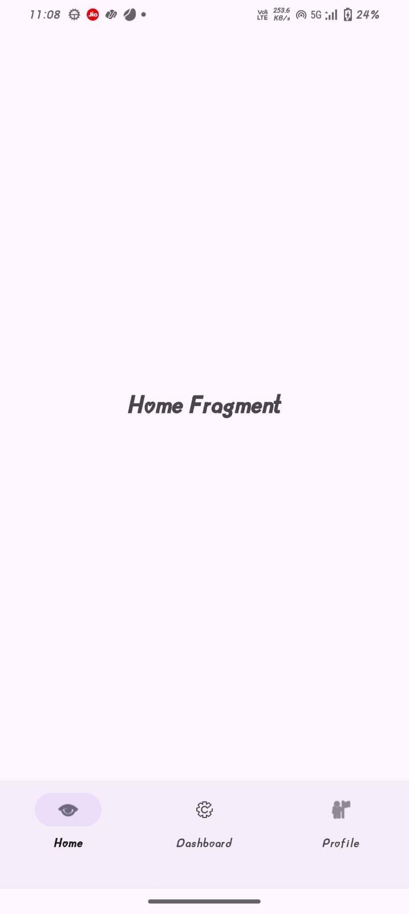
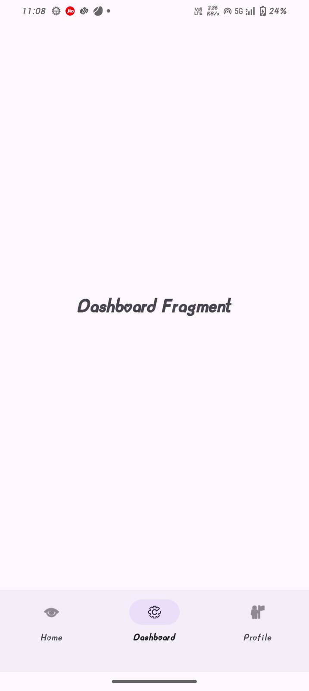
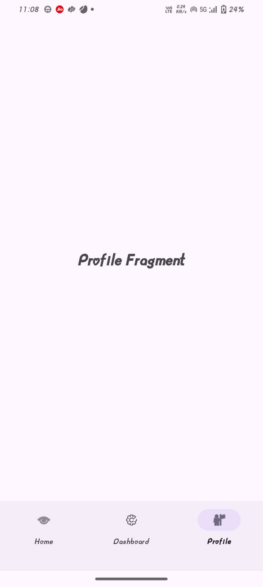

# 🔄 FragmentSwitcher App

A simple yet powerful Android application that demonstrates Fragment switching using Kotlin and Android Jetpack Components.

The app allows users to seamlessly switch between multiple fragments within a single activity, making the UI dynamic and modular.

# 📱 Features

🧩 Multiple Fragments – Display and switch between Home, Profile, and Settings fragments.

🔄 Fragment Transactions – Uses FragmentManager and FragmentTransaction to replace fragments dynamically.

🎨 Modern UI – Clean and minimal UI with Material Design components.

🛠 Kotlin + ViewBinding – Ensures type safety and reduces boilerplate code.

📚 Scalable Architecture – Can be extended with MVVM, Room, or Navigation Component.

# 🖼 Screenshots

### HOME FRAGMENT

### DASHBOARD FRAGMENT

### PROFILE FRAGMENT

	
# 🏗 Tech Stack

Language: Kotlin

UI: XML + Material Design Components

Navigation: Manual Fragment Transactions (FragmentManager)

Architecture: Single Activity + Multiple Fragments

# 📂 Project Structure

FragmentSwitcher_App/

│── app/

│   ├── src/

│   │   ├── main/

│   │   │   ├── java/com/example/fragmentswitcher/

│   │   │   │   ├── MainActivity.kt          # Hosts all fragments

│   │   │   │   ├── HomeFragment.kt          # Fragment 1

│   │   │   │   ├── DashBoardFragment.kt       # Fragment 2

│   │   │   │   ├── ProfileFragment.kt      # Fragment 3

│   │   │   ├── res/

│   │   │   │   ├── layout/activity_main.xml # Main UI with container

│   │   │   │   ├── layout/fragment_home.xml

│   │   │   │   ├── layout/fragment_dashBoard.xml

│   │   │   │   ├── layout/fragment_profile.xml

│   │   │   │   ├── values/colors.xml

│   │   │   │   ├── values/strings.xml

│   │   │   │   ├── values/themes.xml

# ⚡ How It Works

MainActivity hosts a FrameLayout container.

Navigation is handled by buttons / bottom navigation that trigger FragmentTransaction.

Each fragment inflates its own XML layout.

User taps → FragmentManager.replace() swaps the fragment → UI updates dynamically.

# 🚀 Getting Started

Prerequisites

Android Studio Ladybug / Iguana or higher

Kotlin 1.9+

Android Gradle Plugin 8.0+

# Installation

Clone this repository

git clone https://github.com/suhaniranka006/FragmentSwitcher_App.git

Open in Android Studio

Build & Run on an emulator or physical device

# 🛠 Dependencies

dependencies {

    implementation("androidx.core:core-ktx:1.12.0")
    
    implementation("androidx.appcompat:appcompat:1.6.1")
    
    implementation("com.google.android.material:material:1.11.0")
    
    implementation("androidx.constraintlayout:constraintlayout:2.1.4")
    
}

# 🎯 Future Enhancements

🔗 Integrate Jetpack Navigation Component for better fragment handling

🗂 Add ViewModel + LiveData for state management

🌙 Add Dark Mode Support

# 👩‍💻 Author

Suhani Jain

📌 Android Developer | Kotlin Enthusiast | Exploring Jetpack & MVVM

✨ This project is a part of my Android development learning journey. Feedbacks are always welcome! 🚀
